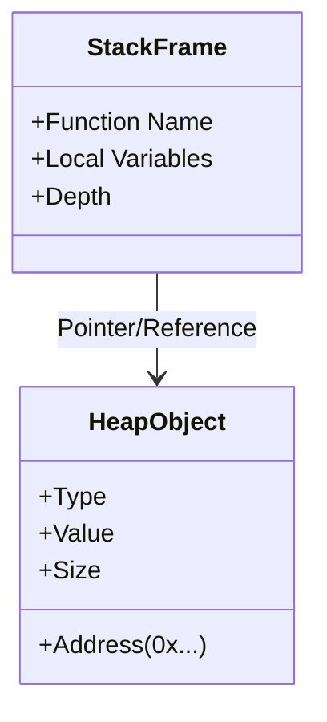

# OKernel Architecture: The Deep Dive

> "The operating system is the soul of the machine." — OKernel Philosophy

OKernel is not just a simulator; it is a **virtual execution environment** that bridges the gap between high-level code and low-level hardware operations. This document details the engineering decisions, data flows, and component interactions that make OKernel ticking.

---

## 1. High-Level System Overview

The system follows a modern **Client-Server-DB** architecture, but with a twist: the Server is a specialized **Execution Engine** capable of running untrusted code safely while inspecting its internal state at the microsecond level.

```mermaid
graph TD
    Client[Client (React/Vite)] -->|HTTP/REST| SysCore
    Client -->|SQL| Supabase[(Supabase DB)]
    
    subgraph SysCore[SysCore (Rust Backend)]
        API[Axum API Layer]
        CM[Container Manager]
        Docker[Docker SDK]
    end
    
    SysCore -->|Spawn| Containers[Ephemeral Containers]
    Containers -->|Trace Data| Supabase
```

### Key Components:
- **Frontend (The Visualizer)**: A high-performance React application that renders the "Matrix" of execution data. It handles code editing, state management, and complex visualizations (FlameGraphs, Memory Maps).
- **Backend (SysCore)**: A Rust-based high-concurrency server. It manages the lifecycle of Docker containers, enforcing strict resource limits and timeouts.
- **Database (Supabase)**: Stores execution traces, user profiles, and historical jobs. It acts as the "Black Box Recorder" for every execution.

---

## 2. The Execution Pipeline (The "Heartbeat")

When a user clicks **EXECUTE**, a sophisticated pipeline is triggered. This isn't just `eval()`; it's a controlled industrial process.

### Step 1: Request Isolation
1.  **Ingestion**: The frontend packages the code (Python/C++) and Input (Stdin) into a JSON payload.
2.  **Dispatch**: The request hits `/api/execute` on SysCore.
3.  **Containment**: SysCore spins up a dedicated Docker container (`syscore-python` or `syscore-cpp`). This container is ephemeral—it lives only for the duration of the execution.

### Step 2: Granular Instrumentation (The "Probe")
Inside the container, we don't just run the code. We **trace** it.

#### Python Runner (`sys.settrace`)
We inject a custom runner that hooks into the Python interpreter's `sys.settrace`.
-   **Line Events**: Every line of code executed emits an event.
-   **Opcode Analysis**: We inspect the bytecode instructions (`dis`) to estimate CPU cost.
-   **Memory Deltas**: We use `tracemalloc` to track every byte allocated or freed.
-   **Variable Inspection**: We capture local variables at every frame, resolving pointers and references.

#### C++ Runner (GDB-Python)
For C++, we compile with debug flags (`-g -O0`) and run the binary under **GDB**.
-   **GDB Python API**: A custom script drives GDB, stepping through the code line-by-line.
-   **Stack Inspection**: We query GDB for stack frames and local variables.
-   **Safety**: If the user code segfaults, GDB catches it and reports the exact memory violation.

### Step 3: Data Synthesis & Storage
1.  **Serialization**: The raw events (Line numbers, variables, timestamps) are serialized into a massive JSON array.
2.  **Upload**: The container uploads this trace directly to **Supabase Storage**.
3.  **Handoff**: SysCore returns a `Job ID` to the frontend.

### Step 4: Visualization (The "Matrix")
The frontend receives the Job ID and fetches the trace.
-   **Replay Engine**: The visualizer "plays back" the trace events.
-   **State Reconstruction**: At every step, it reconstructs the Stack and Heap state from the event logs.
-   **Attribution**: It correlates time deltas with specific lines of code to generate heatmaps.

---

## 3. The Memory Model (Stack vs Heap)

OKernel's proudest feature is its visual breakdown of memory.



-   **Stack**: Visualized as a LIFO stack of function frames. We show variables as "Roots".
-   **Heap**: Visualized as a chaotic but connected graph of objects.
-   **Pointers**: We calculate the relationships between Stack Variables and Heap Objects, drawing Bezier curves (using `react-xarrows`) to show references. This visualizes **Aliasing** and **Garbage Collection** intuitively.

---

## 4. Hardware Simulation (The "Ghost in the Machine")

While we run on high-level runtimes, OKernel estimates low-level hardware behavior to teach "Machine Sympathy".

-   **The Pipeline**: We simulate the Fetch-Decode-Execute cycle based on opcode complexity.
-   **Branch Prediction**: We track control flow changes. Smooth sequential execution is "Predicted Correctly"; sudden jumps (if/else) are "Mispredictions".
-   **Memory Bus**: We classify operations as `MEM_READ` or `MEM_WRITE` based on opcode types (e.g., `LOAD_CONST` vs `STORE_NAME`), simulating bus traffic.

---

## 5. Security & Isolation

-   **Docker Sandbox**: Code runs as a non-root user with no network access (`--network none`).
-   **Timeouts**: Hard limits (e.g., 5 seconds) prevent infinite loops from locking resources.
-   **Memory Limits**: Containers are capped (e.g., 128MB) to prevent OOM attacks.

---

## 6. Future Roadmap

1.  **Distributed SysCore**: Run SysCore on a Kubernetes cluster for massive scale.
2.  **WASM Runtime**: Execute safe languages (Rust/Go) directly in the browser via WebAssembly.
3.  **Collaborative Debugging**: Multiplayer "Google Docs style" debugging sessions.

---
*Architecture Document v1.1.0 — Generated by Antigravity*
