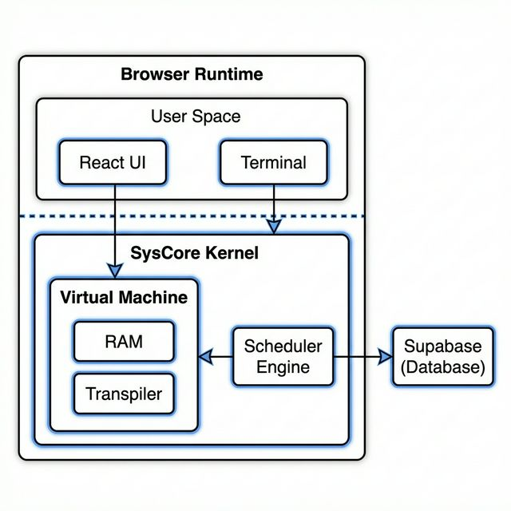
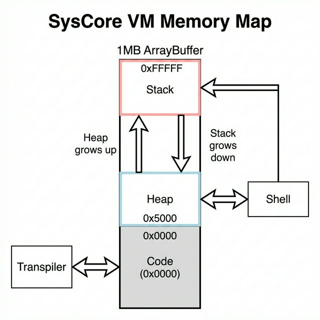

# The OKernel Architecture Manifesto

> **Version:** 1.0.1 (Stable)
> **Codename:** "SysCore"
> **Maintainer:** @Vaiditya2207

---

## 1. Our Philosophy

Most "OS Simulators" are lies. They are mere animations—state machines that pretend to compute.

**OKernel is different.**

We believe that to truly understand an Operating System, you must constrain yourself to its limits. We built **SysCore**, a functional simulation engine that introduces "Artificial Hardware Constraints" into the limitless environment of the JavaScript browser runtime.

-   **We don't use variables.** We use a raw 1MB `ArrayBuffer` for memory.
-   **We don't use `eval()`.** We process C-like code through a regex-based transpiler to inject our own Kernel Traps.
-   **We don't guess.** Every process execution is cycle-accurate, driven by a deterministic tick loop.

---

## 2. The High-Level View

The application is a **Monolithic Frontend Kernel**. It runs entirely client-side but maintains a strict separation between "User Space" (The React UI) and "Kernel Space" (The SysCore Engine).



---

## 3. The SysCore Virtual Machine

The **SysCore VM** (`src/syscore/vm`) is the crown jewel of this project. It provides the isolated environment typically found in C/C++ runtimes, but inside JavaScript.

**Architecture Visualized:**



### 3.1 Memory Management Unit (MMU)
We reject the convenience of JavaScript Objects. The MMU (`Memory.ts`) wraps a single `ArrayBuffer(1024 * 1024)`.

-   **Physical Addressing**: `0x0000` to `0xFFFFF`.
-   **Safety**: All reads/writes (`read32`, `write8`) are bounds-checked. A "Segmentation Fault" is just a standard JS Error we throw when you touch `0x100000`.
-   **Heap Allocator**: A Bump Allocator starting at `0x5000`. It grows upwards.
-   **Stack Allocator**: Starts at `0xFFFFF` and grows downwards. If `Heap_Ptr >= Stack_Ptr`, we throw a "Stack Overflow" / "OOM" Kernel Panic.

### 3.2 The Transpiler Pipeline (`Transpiler.ts`)
How do we run C code like `int x = 10;` in the browser?

1.  **Lexical Analysis**: We scan for C keywords (`int`, `char*`, `while`).
2.  **Memory Injection**:
    -   `int x = 10;` becomes:
        ```javascript
        const x_ptr = __sys.stack_alloc(4);
        __sys.write32(x_ptr, 10);
        ```
    -   Every variable access `x` becomes `__sys.read32(x_ptr)`.
3.  **Preemptive Multitasking Injection**:
    -   JavaScript is single-threaded. An infinite loop `while(1)` freezes the tab.
    -   We inject `await __sys.yield()` into every loop body.
    -   This allows the "Kernel" to pause execution, render a frame (60fps), and then resume the user's code in the next microtask.

---

## 4. The CPU Scheduler (`src/apps/cpu_scheduler`)

The Scheduler Visualization is an application running *on top* of the SysCore primitives. It implements standard Scheduling Algorithms found in Silberschatz & Galvin's "Operating System Concepts".

### 4.1 The Tick Loop
Instead of `setTimeout`, we use `requestAnimationFrame` to drive a deterministic "Tick".
1.  **Fetch**: Get the current Running Process.
2.  **Examine**: Check `BurstTime` vs `Quantum`.
3.  **Execute**:
    -   `RemainingTime--`
    -   Check for Preemption (SRTF/Priority).
4.  **Context Switch**: If necessary, move Current to Ready/Terminated, pick Next from Ready Queue.

### 4.2 Algorithm Implementations (`src/syscore/cpu/algos`)
Each algorithm is a pure function: `(processes, context) -> NextProcess`.

-   **FCFS**: Simple Queue `shift()`. $O(1)$.
-   **SJF**: Sort by `burstTime`. $O(N \log N)$.
-   **Round Robin**: Checks `timeSlice >= quantum`. Rotates Queue. $O(1)$.

---

## 5. Directory Structure Map

Understanding the codebase layout is key to contributing.

```text
src/
├── app/                  # Application Entry
│   ├── App.tsx           # Router & Main Combiner
│   └── main.tsx          # DOM Entry Point
│
├── apps/                 # User-Facing "Apps"
│   ├── cpu_scheduler/    # The Visualizer (Gantt Chart, Controls)
│   └── shell_maker/      # The CIDE (Code Editor, Compiler UI)
│
├── components/           # Shared UI Library
│   ├── layout/           # Navbar, Footer, Container
│   └── ui/               # Buttons, Inputs, Cards (Glassmorphism)
│
├── hooks/                # React Hooks
│   ├── useTerminal.tsx   # Tying xterm.js to ShellKernel
│   └── useSystemConfig.ts # Supabase Config Sync
│
├── pages/                # Static Pages
│   ├── Architecture.tsx  # The page you are updating
│   └── About.tsx         # Credits & Stats
│
└── syscore/              # THE KERNEL SPACE
    ├── cpu/              # Scheduling Logic
    │   └── algos/        # RoundRobin.ts, SJF.ts...
    │
    ├── vm/               # Virtual Machine Stats
    │   ├── Memory.ts     # The ArrayBuffer
    │   ├── Transpiler.ts # C-to-JS Logic
    │   └── ShellKernel.ts # The PID 1 Process
    │
    └── terminal/         # Command Dispatcher
        └── commands/     # ls, cd, help implementations
```

---

## 6. Technical Stack

-   **Frontend**: React 18, TypeScript 5, Vite 5.
-   **Styling**: Tailwind CSS (Custom "Zinc" Theme).
-   **Icons**: Lucide React.
-   **Backend**: Supabase (PostgreSQL 15 + GoTrue).
-   **Testing**: Vitest (Unit) + React Testing Library (Integration).

---

## 7. Future Architecture Goals

-   **WebAssembly Core**: Eventually replace `Transpiler.ts` with a real WASM-based C compiler (Clang-in-browser).
-   **Multi-Threading**: Use Web Workers to move `SysCore` off the main UI thread.
-   **P2P Networking**: Use WebRTC to allow terminals to "SSH" into each other.
